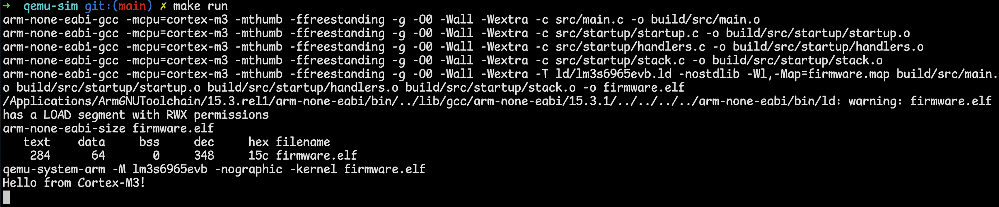

# lm3s6965-qemu-startup

Minimal bare-metal startup code for an ARM Cortex-M3, written in C from scratch — no vendor SDK, no assembly, no C library. Runs on QEMU's emulated TI Stellaris **LM3S6965** evaluation board.

## Example: Hello over UART

`src/main.c` contains a small example that prints `Hello from Cortex-M3!` to the terminal. It writes each character to the UART0 data register at `0x4000C000`, and QEMU forwards UART0 output to your terminal:

```c
#define UART0_DR (*(volatile uint32_t *)0x4000C000)

static void uart_putc(char c) {
    UART0_DR = (uint32_t)c;
}
```

Build and run it with `make run`:



> QEMU's UART works without any setup. On real LM3S6965 hardware you would first need to enable the UART clock, configure the GPIO pins and baud rate, and check the TX FIFO before writing.

## Requirements

- [Arm GNU Toolchain](https://developer.arm.com/downloads/-/arm-gnu-toolchain-downloads) (`arm-none-eabi-gcc`)
- QEMU (`qemu-system-arm`)

On macOS:

```sh
brew install --cask gcc-arm-embedded
brew install qemu
```

On Linux:

```sh
# Debian / Ubuntu
sudo apt install gcc-arm-none-eabi qemu-system-arm gdb-multiarch

# Fedora
sudo dnf install arm-none-eabi-gcc-cs arm-none-eabi-newlib qemu-system-arm gdb

# Arch
sudo pacman -S arm-none-eabi-gcc arm-none-eabi-newlib arm-none-eabi-gdb qemu-system-arm
```

Check that the tools are installed and that QEMU knows the board:

```sh
arm-none-eabi-gcc --version
qemu-system-arm -M help | grep lm3s6965evb
```

## Build and run

```sh
make          # build firmware.elf
make run      # run in QEMU (quit: Ctrl-A, then X)
make clean    # remove build output
```

## Debugging with GDB

```sh
make debug    # QEMU starts paused, GDB server on :1234
```

In another terminal:

```sh
arm-none-eabi-gdb firmware.elf -ex "target remote :1234"
(gdb) break Reset_Handler
(gdb) continue
```

On Debian/Ubuntu there is no `arm-none-eabi-gdb` package — use `gdb-multiarch` instead:

```sh
gdb-multiarch firmware.elf -ex "target remote :1234"
```
